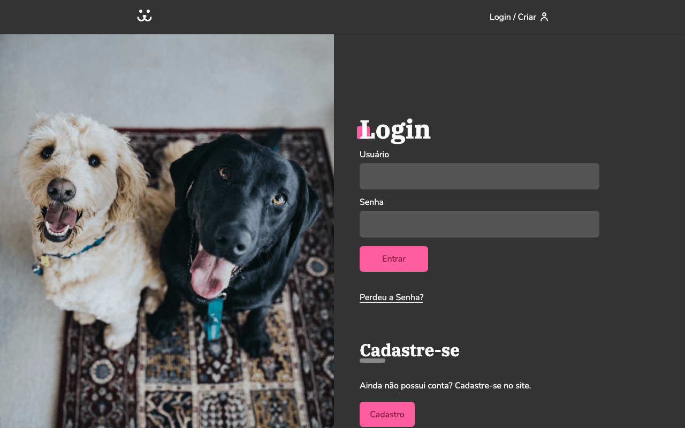
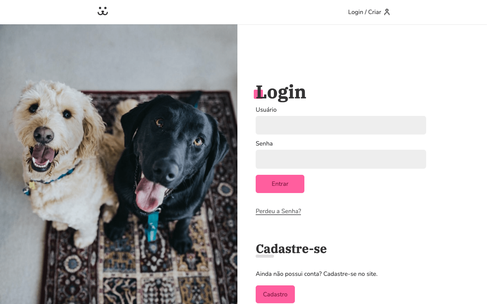
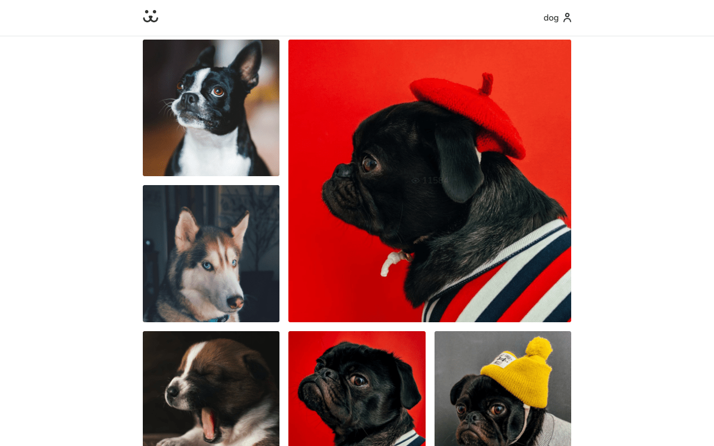
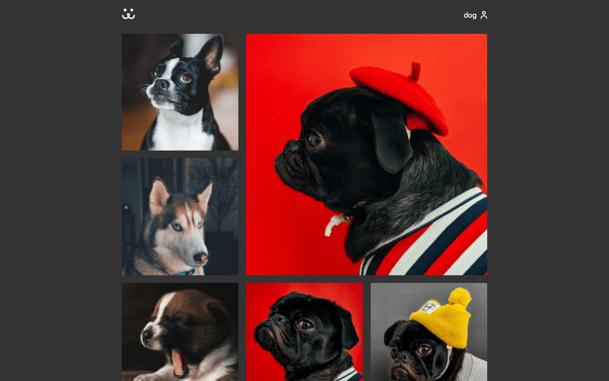

# Dogos

> Projeto de conclusão do curso **React completo**, da [Origamid](https://www.origamid.com/curso/react-completo/).

### 💡 Contexto

Neste curso você irá aprender a como utilizar o React do zero para o desenvolvimento de aplicações web reativas.

Você irá aprender a criar um aplicativo web com funcionalidades parecidas de redes sociais como o Instagram.

O foco do curso é no entendimento completo do React, com isso praticamente tudo será criado do zero, sem a dependência de pacotes externos.

### 🔥 Motivação

Buscando aprimorar e evoluir com a bibllioteca, decidi finalizar este excelente curso da Origamid, mistrado pelo André Rafael. São várias sacadas que ele oferece, além do básico e até conceitos mais avançados com o próprio React.

Para este projeto acabei adicionando mais funcionalidades que ele apresenta no curso, como o _dark mode_ (com o CSS media `prefers-color-scheme: dark`) uso de TypeScript (ao invés de simplesmente JavaScript), além de alterar a estrutura de arquivos e pastas.

Enfim, uma forma de crescer e aumentar ainda mais a experiência em React.

### 🚀 Resultado







#### ⚙️ Instalação

Para inicializar o projeto localmente, siga os passos descritos abaixo:

```bash
# Clone o repositório
$ git clone https://github.com/matheusgrigoletto/origamid-dogs-v2.git

# Entre no repositório
$ cd origamid-dogs-v2

# Instale as dependências
$ yarn

# Se preferir, pode utilizar o NPM:
$ npm install

# Execute a aplicação
$ yarn start

# Ou, com o NPM:
$ npm start
```

Por fim, acesse a aplicação em <http://localhost:3000>.

> Como estamos usando a API da Origamid, os dados são resetados a cada 10 minutos.

### 🍻 Contato

Qualquer dúvida ou feedback você pode me encontrar em qualquer um desses lugares:

<p align="center">
<a href="mailto:eu@matheusgrigoletto.com" target="_blank">

</a>

<a href="https://www.linkedin.com/in/matheus-grigoletto/" target="_blank">

</a>

<a href="https://matheusgrigoletto.com" target="_blank">

</a>
</p>
